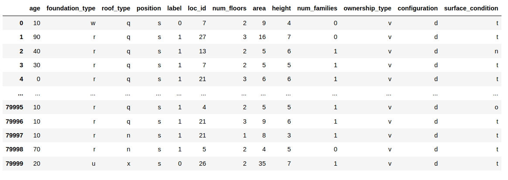

# ML101 Practial 2 - Earthquake destruction prediction

## The data

The dataset mainly consists of information on the buildings' structure and 
their legal ownership. Each row in the dataset represents a specific building 
in the region that was hit by earthquake. Here is a snapshot:


The data is stored in a csv file `data/train.csv` 

## Process
You need to implement the Random Forest algorithm. The \_\_init__ function of 
RandomForestClassifier should work without giving any parameters.
The example of code execution you can find in
 "*tests/test_random_forest.py:TestRandomForestClassifier.test_end_to_end*"
function. 
The testing code which we are going to use is look like this.
```python
model = RandomForestClassifier()

test_data = pd.read_csv("test.csv")
train_data = pd.read_csv("train.csv")

labels = test_data['label'].values
x_train = np.array(test_data.drop('label', axis=1))
y_train = labels

x_train = data_preprocess(x_train)
model.fit(x_train, y_train)


labels = test_data['label'].values
x = np.array(test_data.drop('label', axis=1))
y = labels

x = data_preprocess(x)
y_predict = model.predict(x)
print(f1_score(y, y_predict))
```
There is going to be a execution time limit about 5min

### To get good score, you need to understand the data well.
You may want to do some feature engineering and/or stacking, blending to get 
higher score.
Your score will be calculated using f1_score function.